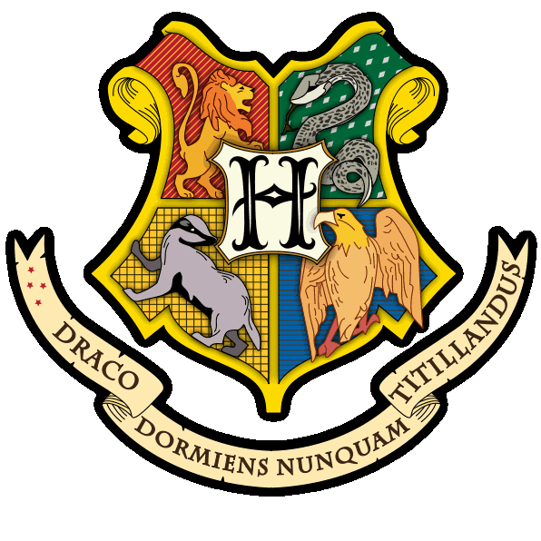

  

  
  

Este projeto foi desenvolvido como parte dos meus estudos em desenvolvimento web. Inspirado no universo mágico de Harry Potter, o site apresenta informações sobre as casas de Hogwarts.

---

## 🚀 Tecnologias Utilizadas

  
  
  

 

---

## 🧠 O que eu pratiquei

- Estruturação de páginas com **HTML semântico**
- Estilização com **CSS Flexbox**, posicionamento fixo, gradientes e efeitos visuais
- Manipulação do DOM com **JavaScript puro**
- Criação de **menus dropdown**, efeitos de **scroll no cabeçalho** e destaque em links ativos
- Organização de seções com layout alternado (imagem e texto intercalados)

---

## ✨ Recursos e Destaques

- 🏰 **Apresentação das casas de Hogwarts**: Grifinória, Sonserina, Corvinal e Lufa-Lufa, cada uma com sua própria paleta de cores e informações
- 🎨 **Design visual personalizado**: Gradientes mágicos, fontes estilizadas e imagens que reforçam o tema do mundo bruxo
- 📱 **Layout responsivo**: Compatível com diferentes tamanhos de tela
- 📌 **Cabeçalho fixo com efeito de scroll**
- 🎯 **Menu com dropdown interativo** para navegação entre as casas

---
 

> 💡[Clique aqui para acessar](https://mirellanovroch.github.io/Hogwarts-Site/)

> 📌 Este projeto ainda está em desenvolvimento e continuará recebendo melhorias conforme avanço nos meus estudos.

 

## 🪄 Feito com curiosidade e muita magia!
Desenvolvido por uma **corvina** cujo patrono é um elegante **gato Tonquinês**